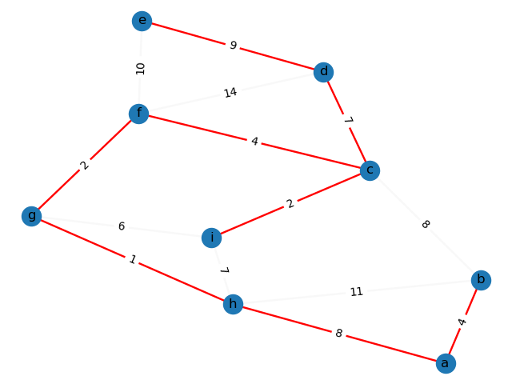
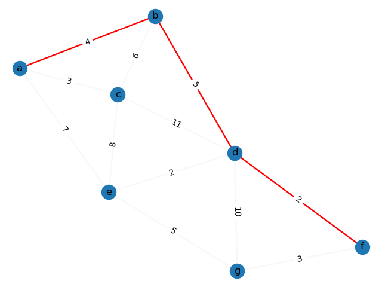
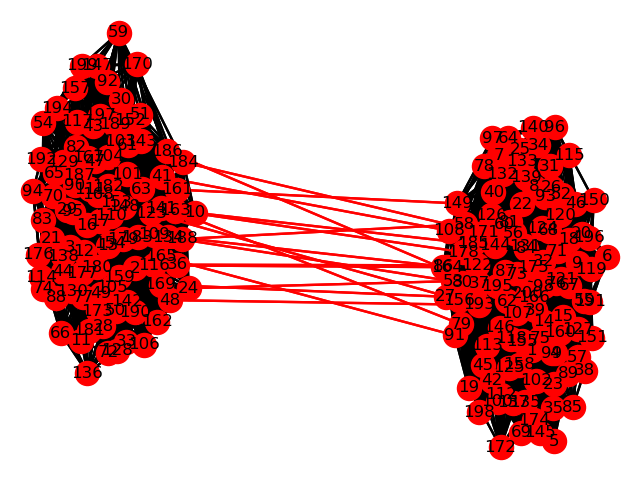
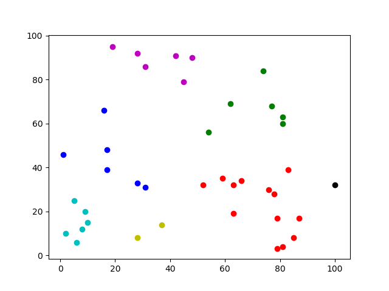

## Algorithms. 

This repository is a collection of ~20 popular algorithms implemented in Python. It's intended to cover different design paradigms <br/>and if possible, to illustrate problems they solve.


### Sorting:

* #### Selection sort [[*code*](selection_sort.py)]

 Basic *O(n^2)* sorting algorithm.

* #### Quicksort [[*code*](quick_sort.py)]

 An example of "*divide and conquer*" algorithm with an average *O(n log n)* complexity. <br/>The implementation provides comparisons counter and pivot selection.

* #### Merge sort [[*code*](merge_sort.py)]

 Another example of "*divide and conquer*" algorithm. The implementation can monitor a number of inversions.

* #### Heap sort [[*code*](heap_sort.py)]

 There are two versions of this algorithm. The first one takes advantage of `heapq` library. The second one is a part of heap data structure implementation. That's exactly what makes a difference between this and *selection sort* algorithms - the heap under the hood.


### Extract min/max value:

* #### Heap [[*code*](heap.py)]

 The implementation supports both, min and max heaps. There is also `sort` method and opportunity to `draw` a heap to stdout.

```Python
    heap = Heap(maxheap=True)  # maxheap
    heap.heapify([1, -2, 3, 18, 2, -8, 12, 4, 5, -6, 9, 3, 2, 0, 45])
    heap.draw(print_width=80)
```
```bash
                                                                                   Level: 0 
                                           45                                       
                                                                                   Level: 1 
                       9                                       18                   
                                                                                   Level: 2 
             4                   5                   3                   12         
                                                                                   Level: 3 
        -2        3         -6        2         -8        2         0         1  
```


* #### Median maintenance [[*code*](median_maintenance.py)]

 Briefly speaking, there are two heaps, min and max. The algorithm do its best to keep a number of elements in each of them equal all the time.<br/>The value "between" heaps is the median.


### Minimum spanning tree:

* #### Prim-Dijkstra-Jarnik MST [[*code*](prims_mst.py)]

 It's almost a copy of Dijkstra's shortest path algorithm. They're very similar to each other.


* #### Kruskal's MST [[*code*](kruskals_mst.py)]

 The implementation is based on `union-find` ([disjoint-set](disjoint_set.py)) data structure.

#### Illustration:


### The shortest path:
* #### Dijkstra shortest path [[*code*](dijkstra.py)]

 It's almost a copy of Prim-Dijkstra-Jarnik MST algorithm. They're very similar to each other.

* #### Bellman-Ford shortest path [[*code*](bellman_ford.py)]

 Bellman-Ford with negative weight cycle detection.

#### Illustration:


### Other graph algorithms:

* #### DFS topological sort [[*code*](dfs_toplogical_sort.py)]

 Uses depth-first search on a directed acyclic graph. DFS recursive calls and backtracking.

* #### Breadth-first search BFS [[*code*](bfs.py)]

 It checks if a graph is connected. It can also count distance (as a number of edges) between nodes. <br/>Works on both, directed and undirected graphs.

* #### Kosaraju's strongly connected components algorithm [[*code*](kosaraju_scc.py)]

 Two runs of DFS. First run traverses the graph and builds a stack of nodes according to finishing times.<br/>Second run traverses the reversed graph in the order of nodes in the stack, sets leaders and groups components.

* #### Karger's mincut algorithm [[*code*](karger_mincut.py)]

 Karger's contraction concept is realized as a Monte Carlo type algorithm, that has to be run
multiple times<br/>with hope to find minimum cuts, but with no guarantee.

 #### Illustration:
 


### Miscellaneous:

* #### 2 sum problem [[*code*](2sum.py)]

 Are there any two numbers in a given list, that create a given sum? Four approaches for solving the problem:<br/>`brute force`, `hashing`, `binary search` and `inward walk`. 

* #### Huffman codes [[*code*](huffman_code.py)]

 Lossless compression based on prefix Huffman codes.

* #### Knapsack problem [[*code*](knapsack.py)]

 Dynamic programming example, memoization leads to a pretty and effective solution.

* #### Tasks scheduler [[*code*](tasks_scheduler.py)]

 Simple task scheduler based on weight/length ratio. Computes weighted completion time as well.

* #### Clustering [[*code*](clustering.py)]

 The algorithm groups items in k clusters. It's based on the "union-find" structure.

 #### Illustration:
 

### Tools:

* #### Adjacency list [[*code*](adjacency_list.py)]

 It's just a supporting tool for some of the above graph algorithms.

* #### Display graph [[*code*](display_graph.py)]

 Another supporting tool. It uses `matplotlib` and `networkx` to display results of couple of the above graph algorithms.


## Appendix

* If you'd like to learn more about algorithms, data structures, proofs and various theoretical concepts in general, I recommend Tim Roughgarden's classes where you should find a fair and satisfying set of information, that covers all these topics.

* If you find a bug, typo or have any questions, please feel free to contact me.

### Contact

#### abcs.luk@gmail.com

### License
[MIT](https://choosealicense.com/licenses/mit/)
